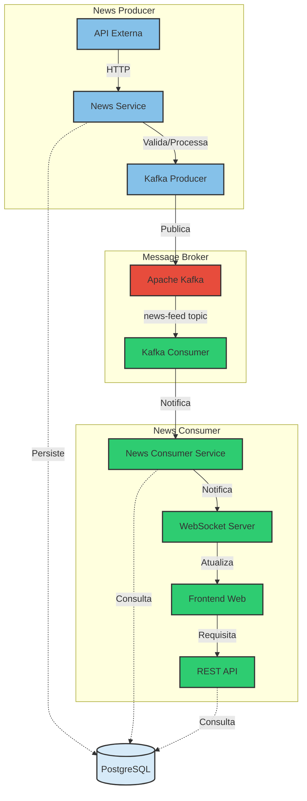

# Serviço de Notícias (Consumer)

Este é o serviço consumidor do sistema de notícias, responsável por receber, processar e armazenar as notícias distribuídas pelo Apache Kafka, além de disponibilizá-las através de uma interface web em tempo real.

## 🎯 Objetivo

O projeto tem como objetivo consumir notícias em tempo real, armazená-las no banco de dados e disponibilizá-las através de uma interface web com atualizações em tempo real via WebSocket. O sistema é composto por dois serviços:
- **news**: Serviço produtor que coleta e valida as notícias
- **news-consumer (este repositório)**: Serviço consumidor que processa, armazena e exibe as notícias

## 🏗️ Arquitetura do Sistema

O sistema de notícias é composto por dois serviços que se comunicam via Apache Kafka e compartilham um banco de dados:



### Componentes

1. **News Producer**
   - API Externa: Fonte de notícias
   - News Service: Processamento e validação
   - Kafka Producer: Publicação de eventos

2. **Message Broker**
   - Apache Kafka: Sistema de mensageria
   - Tópico 'news-feed': Canal de eventos

3. **News Consumer**
   - Kafka Consumer: Consumo de eventos
   - Consumer Service: Gerenciamento
   - WebSocket: Atualizações em tempo real
   - Frontend: Interface do usuário
   - REST API: Endpoints de consulta

4. **Banco de Dados**
   - PostgreSQL: Armazenamento centralizado
   - Compartilhado entre os serviços

## 🛠️ Tecnologias Utilizadas

- Java 17
- Spring Boot 3.x
- Apache Kafka
- PostgreSQL
- WebSocket
- HTML5/CSS3/JavaScript
- Docker
- Docker Compose

## 📋 Pré-requisitos

- Docker Desktop
- Java 17+
- Maven
- PostgreSQL


## 🚀 Configuração e Execução

### 1. Configuração do Ambiente

Execute o Docker Compose para iniciar o Kafka e PostgreSQL:

```bash
docker-compose up -d
```

### 2. Configuração do Projeto

1. Clone o repositório
2. Configure o `application.properties`:

```properties
# Aplicação
spring.application.name=news-consumer
server.port=8081

# Kafka Consumer
spring.kafka.consumer.bootstrap-servers=localhost:9092
spring.kafka.consumer.group-id=news-consumer-group
spring.kafka.consumer.auto-offset-reset=earliest

# PostgreSQL
spring.datasource.url=jdbc:postgresql://localhost:5432/system_news
spring.datasource.username=seu_usuario
spring.datasource.password=sua_senha
```

3. Execute o projeto:
```bash
mvn spring-boot:run
```

## 📊 Funcionalidades

- Consumo automático de notícias do Kafka
- Armazenamento de notícias no PostgreSQL
- Interface web responsiva
- Atualizações em tempo real via WebSocket
- Sistema de notificações push
- Visualização em cards
- Modo escuro/claro
- Design responsivo

## 🔄 Fluxo de Dados

1. Notícias são recebidas do Kafka
2. Dados são processados e salvos no banco
3. WebSocket notifica clientes conectados
4. Interface atualiza em tempo real
5. Notificações são exibidas para o usuário

## 📝 Endpoints

### REST API
- `GET /api/v1/news`: Lista todas as notícias
- `GET /api/v1/news/{id}`: Busca notícia por ID
- `GET /api/v1/news/search`: Busca notícias por termo

### WebSocket
- `/ws-news`: Endpoint WebSocket
- `/topic/news`: Tópico para atualizações em tempo real

## 🌐 Inicialização do Frontend

### Pré-requisitos para o Frontend
- Navegador moderno (Chrome, Firefox, Edge)
- Backend Spring Boot rodando
- Serviços Docker ativos (Kafka e PostgreSQL)

### Passos para Iniciar o Frontend

1. **Verificar Serviços**
   ```bash
   # Verificar status dos containers Docker
   docker ps
   
   # Se necessário, iniciar os serviços
   docker-compose up -d
   ```

2. **Iniciar o Backend**
   ```bash
   # Na pasta raiz do projeto
   mvn clean spring-boot:run
   ```

3. **Acessar a Interface Web**
   - Abra seu navegador
   - Acesse: `http://localhost:8081/index.html`

### Testando o Frontend

1. **Enviar Notícia de Teste**
   ```bash
   # Acessar o producer do Kafka
   docker exec -it kafka kafka-console-producer.sh --broker-list localhost:9092 --topic news-feed
   
   # Cole o JSON de exemplo:
   {"title":"Teste Frontend","content":"Esta é uma notícia de teste","url":"https://exemplo.com","imageUrl":"https://via.placeholder.com/300x200"}
   ```

2. **Verificar Funcionamento**
   - Indicador de status deve mostrar "Conectado"
   - A notícia deve aparecer automaticamente na interface
   - Uma notificação deve ser exibida

## 🔍 Monitoramento

O serviço possui logs detalhados de:
- Consumo do Kafka
- Processamento de mensagens
- Conexões WebSocket
- Acesso à API REST

### Estrutura de Arquivos Frontend
```
static/
├── css/
│   └── styles.css
├── js/
│   ├── websocket.js
│   ├── newsService.js
│   └── uiManager.js
└── index.html
```

## ⚙️ Configurações Adicionais

### WebSocket
```properties
spring.websocket.max-text-message-size=8192
spring.websocket.max-binary-message-size=8192
```

### Segurança
```properties
spring.security.csrf.enabled=false
spring.security.cors.allowed-origins=*
```

## 🔧 Comandos Úteis

### Kafka

Consumir mensagens manualmente:
```bash
docker exec kafka kafka-console-consumer.sh --bootstrap-server localhost:9092 --topic news-feed --from-beginning
```

### Maven

Build limpo:
```bash
mvn clean package
```

Executar testes:
```bash
mvn test
```

## 🚨 Troubleshooting

### Problemas Comuns

1. **WebSocket não conecta**
   - Verifique o path do endpoint
   - Confirme se o CORS está configurado
   - Verifique logs do cliente e servidor

2. **Notícias não aparecem**
   - Verifique conexão com Kafka
   - Confirme configurações do consumer
   - Verifique logs do consumer

3. **Interface não atualiza**
   - Limpe o cache do navegador
   - Verifique console JavaScript
   - Confirme conexão WebSocket

## 🔐 Segurança

- Configure CORS adequadamente
- Use HTTPS em produção
- Implemente rate limiting
- Sanitize inputs HTML
- Valide dados do Kafka

## 📚 Documentação Adicional

- [Documentação Spring WebSocket](https://docs.spring.io/spring-framework/reference/web/websocket.html)
- [Documentação Kafka Consumer](https://kafka.apache.org/documentation/#consumerconfigs)
- [WebSocket API](https://developer.mozilla.org/en-US/docs/Web/API/WebSocket)